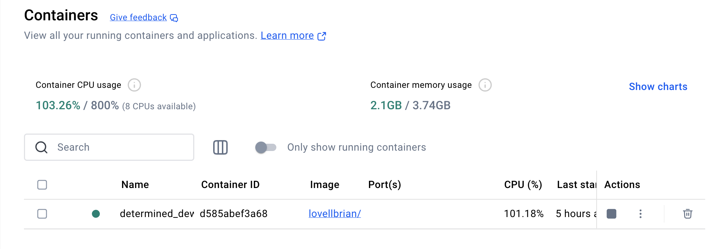

# How to implement CPU/GPU on Personal and Remote Computers 
This blog post will provide a generalised overview on my experience learning AI through fastAI course. 
The subsequent headings will discuss the key topics identified through the course and provide a definition
of said topics

## Setup of Devcontainer + Running CPU_Frozen Fingerprint Recognition 

The first step into understanding the use and application of AI was via the implementation of the fingerprint recognition 
code provided in week 3. The process of setting up my dev container on my Macbook was slightly different to the steps 
provided by Professer Lovell as such I will express what I did to run both cpu and gpu based container implementations. 

### CPU Based Approach

This approach was relatively simple, the process involved downloading both Docker and VS code onto my computer. As a mac 
user, the inbuilt linux interface provided a reduction in steps. As such after downloading the mentioned softwares, opening
VScode and git cloning the fingerprint recognition repository results in the IDE to automatically detect the presence of
a dev container configuration. With this a pop up is shown asking to open in container, in which after doing, results 
in the provided repository to be runnable within a dev container, orchestrated by Docker. 

The below image shows the active dev container run through Docker 

Upon the rebuild of the repository within the container, the provided recognition code within the jupyter notebook can be run. 
NOTE: at the bottom left of the screen, the DEV Container: should be set to CPUfrozen @ desktop-linux. 

### GPU Based Approach

This approach was a bit more tedious as the laptop used did not have an integrated GPU as such another way had to be found. 
For the fingerprint example, the GPUfrozen implementation did not have to be used for the code to function, however, to 
improve my understanding and prepare for subsequent GPU focused tasks, the implementation of the GPU method was looked at. 
There were two main approaches that I made, one was according to my personal home desktop which held a Nvidia RTX3060 and the second
being to remote desktop to the lab computers which hold RTX2080 GPUs.

#### Home Computer

This method was much simpler and required the download of Vscode and Docker. Additionally, WSL was installed to allow for linux 
implementation with the container. Upon cloning of the repository the Dev container rebuild was done in accordance to GPUfrozen
and the program was then run.

#### Remote Computer

This method involved downloading the Windows Remote Desktop Tool on my personal Mac. The application was loaded up and remote desktop
link was initialised. The subsequent lab computer was selected upon signing in and the subsequent softwares were downloaded. From following the steps provided in the previous sections, the VSCode implementation was able to run both CPU and GPU based containers. 

## Conclusion

This blog post provided a summary of how the environment for AI implementation will be done in. This process provides a generalised look on all possible approaches and the application of either CPU or GPU will be dependent on the complexity and requirements of the AI based tasks provided. 
