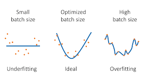

# Batch Size 
This document will summarise what I have learnt regarding batch sizes and their role in training performance. 

## Theoretical Information of Batch Size 
Batch size relates to the volume of training examples implemented at one iteration of the model training prior to model 
weighting update. To reduce the memory usage, a mini batch approach is used to implement the update after a subset of data
is run. This is done to ensure adequate memory usage and time allocation. This is important as allocating smaller batch
sizes leads to reduced memory usage while maintaining training performance. Large batch sizes provide more stability and 
and smoother convergence whereas smaller batch sizes lead to reduced stability and increase noise presence. There is a tradeoff
between both approaches, one results in faster training perforamnce and the latter resulting in reducing memory usage. 
Adequate batch sizes depend on GPU RAM, as such allocated greater batch sizes is directly reflective on the GPU selected. 

The below graph gives a great explanation of the effects of different batch sizes.

